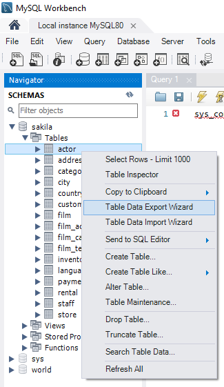

```{r setup, include=FALSE}
knitr::opts_chunk$set(echo = TRUE)
```

---

<div class="logs">
<div class="logs-caption">Logs</div>
<div class="logs-content">
**22.1.2020:** Khởi tạo `ddrHyperText`.

</div></div>

## 5. Image, Address, Block, Code: ddrHyperText

Images
Images on the web or local files in the same directory:




Links
Use a plain http address or add a link to a phrase:

http://example.com

[linked phrase](http://example.com)


<a target="_parent" href="https://rpubs.com/BabyMouse/ddrIntroduction">ddrIntroduction</a>

Reference Style Links and Images
Links
A [linked phrase][id]. 

At the bottom of the document:

[id]: http://example.com/ "Title"

[Qui ước giao tiếp (protocol)](#Protocol)

