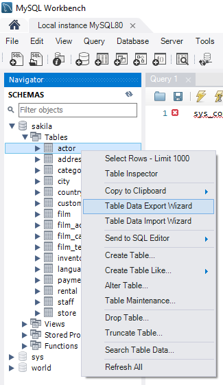
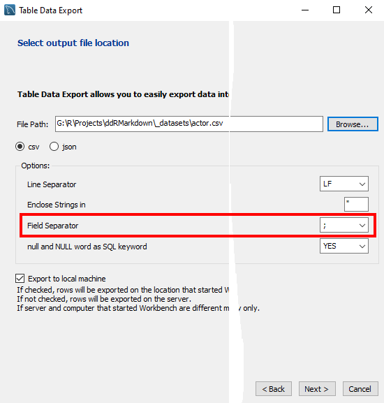

```{r setup, include=FALSE}
knitr::opts_chunk$set(echo = TRUE)
knitr::spin('_template/sourceembed.R')
```
```{r echo=FALSE}
embed_file_a('ddrIntroduction.Rmd')
```

---
<div class="logs">
<div class="logs-caption">Logs</div>
<div class="logs-content scroll">
**29.1.2020**

- Bắt đầu soạn thảo nội dung.

**22.1.2020**

- Khởi tạo `ddrIntroduction`.

</div></div>
<br/>
<div class="logs">
<div class="logs-caption">Nội dung</div>
<div class="logs-content">
# <a target="_parent" href="https://rpubs.com/BabyMouse/ddRMarkdown">Mục lục</a>

### 0. Giới thiệu tổng quan

* [Giới thiệu về dự án](#IntroProj)
	
* [Mục tiêu](#Goal)
	
* [Qui ước giao tiếp (protocol)](#Protocol)
	
	* Xưng hô
	* Ngôn ngữ Anh, Việt
	* Định dạng văn bản, tài liệu
	* Tổ chức tài liệu và cách đọc
	* Phần mềm để thực tập

</div></div>

## 0. Giới thiệu tổng quan

* <a id="IntroProj" />Giới thiệu về dự án
	
* <a id="Goal" />Mục tiêu: Visualization nhưng thiên về Design (kĩ thuật, không phải mĩ thuật) với phạm vi public lên RPubs.
	
* <a id="Protocol" />Qui ước giao tiếp (protocol): Người - Người, Người - Máy
	
	* Xưng hô
	* Ngôn ngữ Anh, Việt
	* Định dạng văn bản, tài liệu
	* Tổ chức tài liệu và cách đọc
	* Phần mềm (version tương ứng) để thực tập: VS Code (và Ext về theme, formatter, code snippets), R (cả RTools), RStudio (add-on Knitr), cả MySQL nếu cần xây dựng database.


<center></center><br/><br/>

<center></center>


Ở mục `Field Separator`{.redmark},

**Nếu chọn `;`{.redmark}** (dấu chấm phẩy)
```{r eval=FALSE, class.source='.some-style'}
read2.csv(pathFile)

#Hoặc xài câu lệnh
read.csv(pathFile, sep = ";")
```

**Nếu chọn `,`** (dấu phẩy)
```{r eval=FALSE}
read.csv(pathFile)
```

<br/><br/><br/><br/>


```{r include=FALSE}
#knitr::knit_exit('<div>abc</div>')
```

